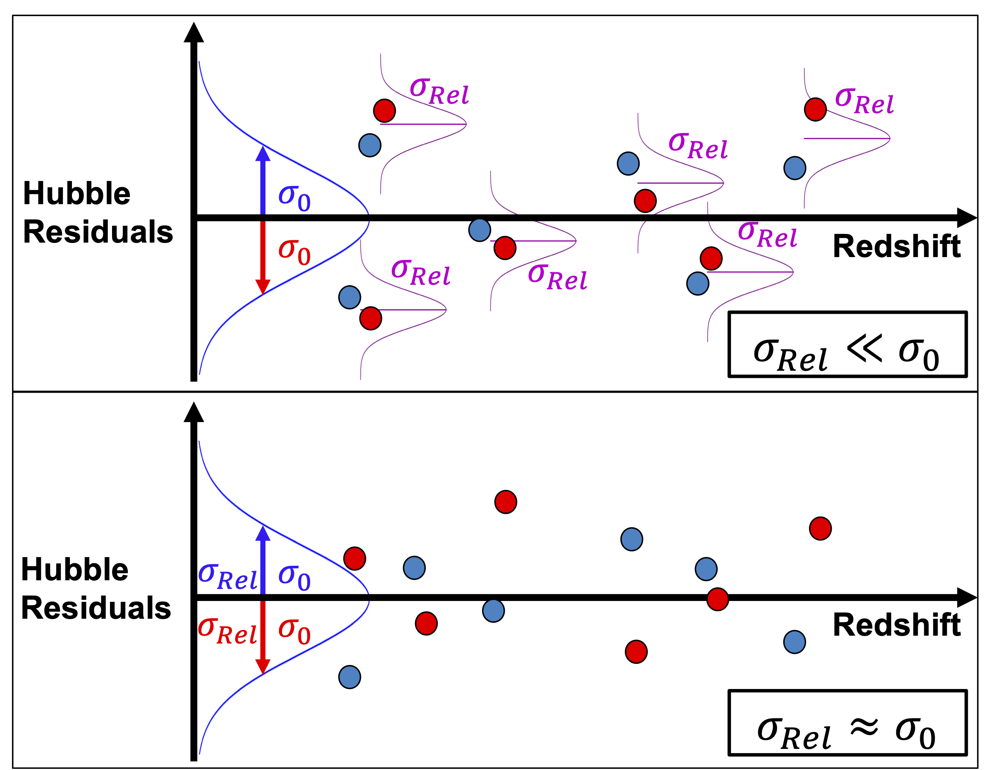

# sigmaRel_computer
Repo for Hierarchically Analysing Siblings Distance Estimates
---

---
sigmaRel_computer is a modular Python+Stan pipeline for hierarchical Bayesian analysis of supernova siblings (supernovae that exploded in the same galaxy). Using photometric distance estimates to individual SN siblings, sigmaRel_computer can be used to perform a:
* Cosmology-independent analysis: Compute a cosmology-independent posterior on the relative intrinsic scatter, $\sigma_{\rm{Rel}}$

Additionally using redshift-based cosmology distances, sigmaRel_computer can be used to perform a:
* Cosmology-dependent analysis: Compute a joint posterior on $\sigma_{\rm{Rel}}$ and the total intrinsic scatter, $\sigma_0$. 

The relative scatter, $\sigma_{\rm{Rel}}$ is the residual scatter of individual siblings distance estimates relative to one another within a galaxy. It quantifies the contribution towards the total intrinsic scatter, $\sigma_0$, from within-galaxy variations about the siblings' common properties. Therefore, the contrast of $\sigma_{\rm{Rel}}$ with $\sigma_0$ indicates whether it is within-galaxy variations ($\sigma_{\rm{Rel}}\approx\sigma_0$), or the population variation of the siblings' common properties ($\sigma_{\rm{Rel}} \ll \sigma_0$) that contributes most towards the total intrinsic scatter in the Hubble diagram. 

### Multi-galaxy Analysis
The default analysis pipeline is the `multi_galaxy` class, used for:
  1) The cosmology-independent analysis, including computing/plotting posteriors for different choices of $\sigma_{\rm{Rel}}$ hyperprior. 
  2) The cosmology-dependent analysis, including computing/plotting posteriors for different assumptions about e.g. the intrinsic scatter hyperpriors, $\sigma_{\rm{pec}}$, and whether to model latent distance or redshift parameters.
  3) Plotting photometric distances estimates and Hubble diagrams.
     
### Single-galaxy Analysis
Also included is the `siblings_galaxy` class for analysing a single siblings-galaxy, used for:
  1) The cosmology-independent analysis, including computing/plotting posteriors for different choices of $\sigma_{\rm{Rel}}$ hyperprior.
  2) Computing a common-distance posterior by marginalising over $\sigma_{\rm{Rel}}$ with an informative hyperprior.
  3) Plotting individual photometric distance estimates.

## Getting Started

Check out [**installation_instructions.md**](https://github.com/sam-m-ward/sigmaRel_computer/blob/main/installation_instructions.md) to clone the repo and set up a conda environment.

See [**tutorial.ipynb**](https://github.com/sam-m-ward/sigmaRel_computer/blob/main/tutorial.ipynb) for a quick practitioner's introduction to sigmaRel_computer.

## Acknowledgements

sigmaRel_computer was developed by Sam M. Ward. 

The relative intrinsic scatter formalism for hierarchically analysing siblings was developed in [**Ward et al. 2023**](https://ui.adsabs.harvard.edu/abs/2022arXiv220910558W/abstract). Please cite when using this code.
